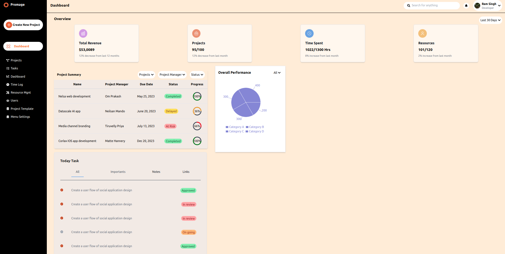

# React + Vite Dashboard

This project is a simple dashboard built using React and Vite. It provides a fast and modern development environment for creating interactive dashboard interfaces.



## Installation

Before getting started, ensure you have Node.js and npm installed on your machine. Then, follow these steps:

1. Clone the repository to your local machine:

   ```bash
   git clone https://github.com/ramsingh10497/react-vite-dashboard.git
   ```

2. Navigate into the project directory:

   ```bash
   cd react-vite-dashboard
   ```

3. Install dependencies using npm:

   ```bash
   npm install
   ```

## Usage

Once the installation is complete, you can run the project locally with the following command:

```bash
npm run dev
```
